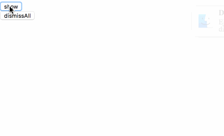

# react-notification

[](http://badge.fury.io/js/react-notification-popup) [](https://www.npmjs.com/package/react-notification-popup) [](https://david-dm.org/igorprado/react-notification-popup) [](https://david-dm.org/igorprado/react-notification-popup#info=devDependencies) [](https://travis-ci.org/igorprado/react-notification-popup) [](https://coveralls.io/github/igorprado/react-notification-popup?branch=master)

A complete and totally customizable component for notifications in React



## Advanced notification system specification

- You can request a notification to be displayed.
- You can request a notification to hide.
- A notification should not be displayed more than 5 seconds.
- Multiple notifications can be displayed at the same time.
- No more than 3 notifications can be displayed at the same time.
- If a notification is requested while there are already 3 displayed notifications, then queue/postpone it.

## Installing

```
npm install react-notification-popup
```

## Using

```js
import React from "react";
import { render } from "react-dom";
import { notification, NotificationContainer } from "react-notification-popup";

notification.config = {
  maxNotifications: 3,
  notificationDisplayTime: 5000
};

const App = () => (
  <div>
    <NotificationContainer />
    <button
      onClick={() => {
        notification.emit(
          {
            providerURL:
              "http://icons.iconarchive.com/icons/johanchalibert/mac-osx-yosemite/1024/finder-icon.png",
            title: "Disk Not Ejected Properly",
            description:
              "Eject Time Machine before disconnecting or turning it off"
          },
          {
            onClick: () => console.log("Click!!"),
            onClose: () => console.log("Close!!")
          }
        );
      }}
    >
      show
    </button>
    <button
      onClick={() => {
        notification.dismissAll();
      }}
    >
      dismissAll
    </button>
  </div>
);

render(<App />, document.getElementById("root"));
```

## Methods

### `config: ({ maxNotifications, notificationDisplayTime })`

Configure notification. This is optional. The default maxNotifications is 3 and notificationDisplayTime is 5s.

### `emit: (

    {
      providerURL,
      title,
      description,
      closeButtonText = "Close",
      hasCloseButton = true,
      autoClose = true
    },
    { onClick = noop, onClose = noop }

)`

Emit notification with some informations and callback handler.

### `dismissAll: (onDismiss = noop)`

Removes ALL notifications programatically.

## Author

[Khuong Pham](https://khuong291.github.io/home/) <br>

## License

react-notification-popup is released under the MIT license.  
See LICENSE for details.
